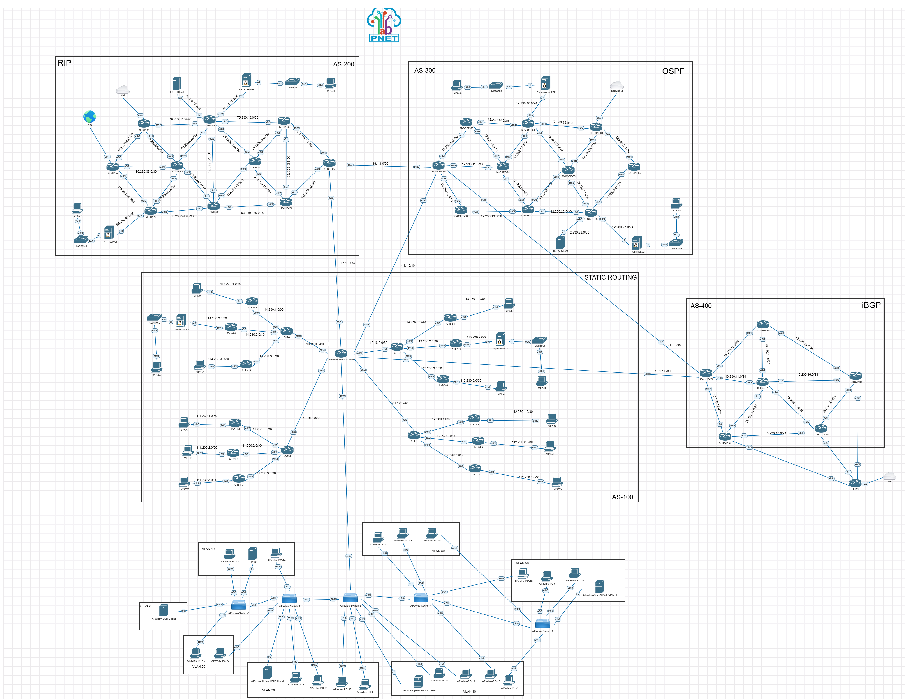

# 🏢 Enterprise Network Lab — PnetLab

> Учебный проект по проектированию и настройке крупной корпоративной сети (101 устройство) с несколькими автономными системами (AS) и динамической маршрутизацией.

## 📌 О проекте

Цель проекта — отработать навыки проектирования, сегментации и настройки маршрутизации в масштабной сети, приближенной к реальной инфраструктуре провайдера или крупной компании. В рамках работы было настроено **101 устройство** (маршрутизаторы Cisco, Mikrotik, коммутаторы, серверы, ПК) в эмуляторе PnetLab.

*Подробнее задачи описаны в файле [Tasks.md](docs/Tasks.md)*

## 🗺️ Топология сети



*Полная схема сети из 101 устройства, разделённая на 4 автономные системы.*

## 🛠️ Использованные технологии

| Технология | Описание |
| :--- | :--- |
| **Маршрутизация** | RIP v2, OSPF, eBGP/iBGP (с конфедерациями), статическая маршрутизация |
| **Коммутация** | VLAN, Trunk, Access-порты |
| **Сервисы** | DHCP, DNS, NAT, SSH, ACL |
| **Оборудование** | Cisco IOL, Mikrotik RouterOS, Linux (Debian), Windows |
| **Эмуляция** | PnetLab, VMware Workstation |

## 🗂️ Структура лабораторной работы

Сеть разделена на 4 автономные системы (AS), каждая со своей внутренней политикой маршрутизации:

*   **AS-100** — Ядро сети, статическая маршрутизация.
*   **AS-200** — Зона с RIP v2.
*   **AS-300** — Зона с OSPF.
*   **AS-400** — Зона с iBGP.

## 🚀 Как запустить проект

1.  Установите [PnetLab](https://pnetlab.com/) (или EVE-NG).
2.  Склонируйте репозиторий:
    ```bash
    git clone https://github.com/Arnik15/pnetlab-enterprise-network.git
